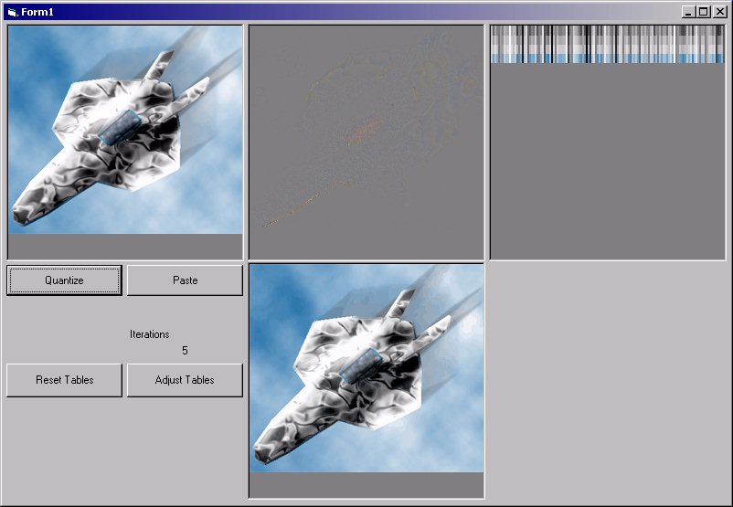

<div align="center">

## Vector Quantization \(image approximation\)


</div>

### Description

This is my take on Vector Quantization. The idea behind this is to use a table of colors, then approximate which index of the table best matches each pixel in the image. After this, the table is adjusted based on the input values, and another test is done. After about 10 iterations, a decent image should be constructed. Now, unless you modify the code, this new image is made up of 128 colors. Yes, colors, not levels per channel. The trick to better images is to add just a little bit of noise to the original. Having 'slow' gradients in an image will take more iterations to estimate, and may still look bad. I used DIBits so there shouldn't be too many problems. I did however limit the size to a max of 256 colors in the table tho it is possible to change. Also, the images are set to 256x256 pixels. I planned on using this as a start of an image compression tool. If you have any suggestions that would help, please let me know. At the moment, I am working out a way to use a huffman tree to compress the pointers to the color index. Anyway, tell me what you think, good or bad.
 
### More Info
 


<span>             |<span>
---                |---
**Submitted On**   |2004-07-09 00:21:42
**By**             |[Erik Stites](https://github.com/Planet-Source-Code/PSCIndex/blob/master/ByAuthor/erik-stites.md)
**Level**          |Intermediate
**User Rating**    |4.9 (34 globes from 7 users)
**Compatibility**  |VB 5\.0, VB 6\.0
**Category**       |[Graphics](https://github.com/Planet-Source-Code/PSCIndex/blob/master/ByCategory/graphics__1-46.md)
**World**          |[Visual Basic](https://github.com/Planet-Source-Code/PSCIndex/blob/master/ByWorld/visual-basic.md)
**Archive File**   |[Vector\_Qua176763792004\.zip](https://github.com/Planet-Source-Code/erik-stites-vector-quantization-image-approximation__1-54833/archive/master.zip)

### API Declarations

```
Private Declare Function GetDIBits Lib "gdi32" (ByVal aHDC As Long, ByVal hBitmap As Long, ByVal nStartScan As Long, ByVal nNumScans As Long, lpBits As Any, lpBI As BITMAPINFO, ByVal wUsage As Long) As Long
Private Declare Function SetDIBits Lib "gdi32" (ByVal hdc As Long, ByVal hBitmap As Long, ByVal nStartScan As Long, ByVal nNumScans As Long, lpBits As Any, lpBI As BITMAPINFO, ByVal wUsage As Long) As Long
Private Declare Function SetPixelV Lib "gdi32" (ByVal hdc As Long, ByVal x As Long, ByVal y As Long, ByVal crColor As Long) As Long
```


